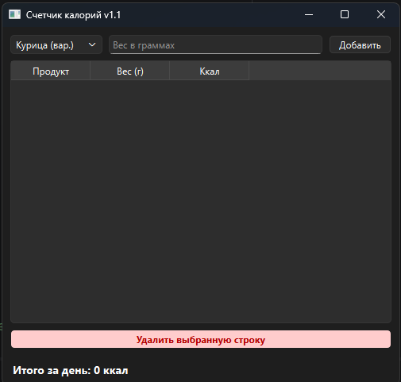

# Калькулятор калорий - версия 1.1
Проект по разработке графического приложения на Python для контроля питания и расчета калорийности рациона

## 📋 Функциональность
- Выбор продуктов из встроенного справочника
- Расчет калорийности на основе введенного веса порции
- Отображение добавленных продуктов в интерактивной таблице
-  **[НОВОЕ в 1.1]** Возможность удаления выбранной строки из таблицы с автоматическим пересчетом итогов
- Автоматический подсчет итоговой суммы калорий за текущую сессию

## 🛠 Технологии
- **Язык программирования**: Python 3.10+
- **Библиотека GUI**: PyQt6
- **Сборка**: PyInstaller (создание .exe файла)

## 🏗 Архитектура приложения
Приложение реализовано с использованием PyQt6:
- **Интерфейс**: Построен на базе `QMainWindow` с использованием менеджеров компоновки (`QVBoxLayout`, `QHBoxLayout`) для адаптивности элементов
- **Логика данных**: Список продуктов и их энергетическая ценность хранятся в формате словаря (Dictionary), что обеспечивает быстрый доступ к данным
- **Обработка событий**: Расчеты и обновление интерфейса происходят через систему сигналов и слотов PyQt6

## 🖼 Интерфейс

## 🚀 Инструкция по запуску
1. Перейдите в раздел **Releases**
2. Скачайте файл `Calorie.exe`
3. Запустите файл (установка Python не требуется)

---
**Разработчик:** jjhu
